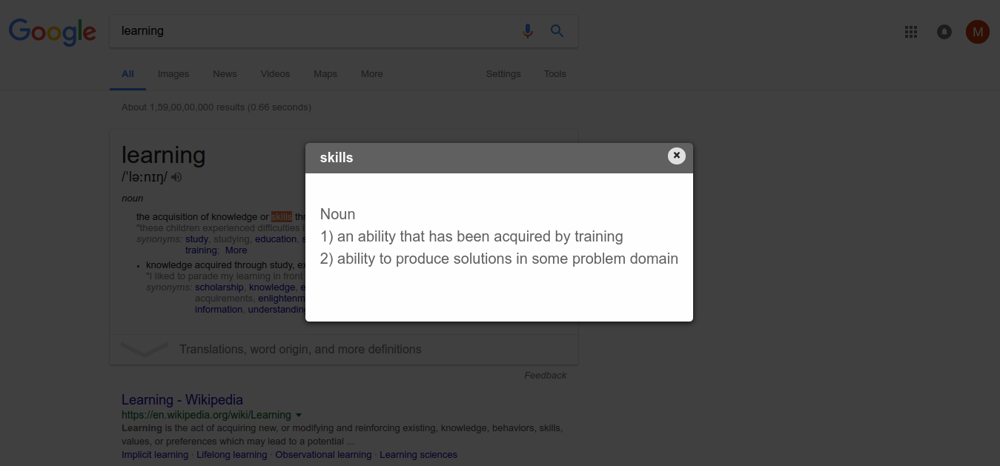

# ClickDictionary
It's a Google chrome/Chromium browser extension to get the meaning of all the new words you come across when browsing online. 

Double click on any word in the web page and you will get the meaning of that word in the alert box.
  

## Setup Extension
1. Download the zip from github and extract it or clone the repository.
2. Open chrome://extensions in chrome/chromium browser.
3. Check on Developer mode.
4. Click on Load Unpacked extension and select the extracted folder.
5. Open a new web page or refresh any already opened webpage. Double click on the word you want meaning for.

## Suggested Improvements
1. Triple click to select the whole line also gives the meaning of the word, any output for triple click has to be disabled.
2. Using modal box instead of alert box near the word selected to show the meaning for better apperance.

## Contribution
Feel free to come up with new ideas, fork, make pull requests and make contribution to make it better extension.

## License
This project is licensed under [MIT License](/LICENSE).
